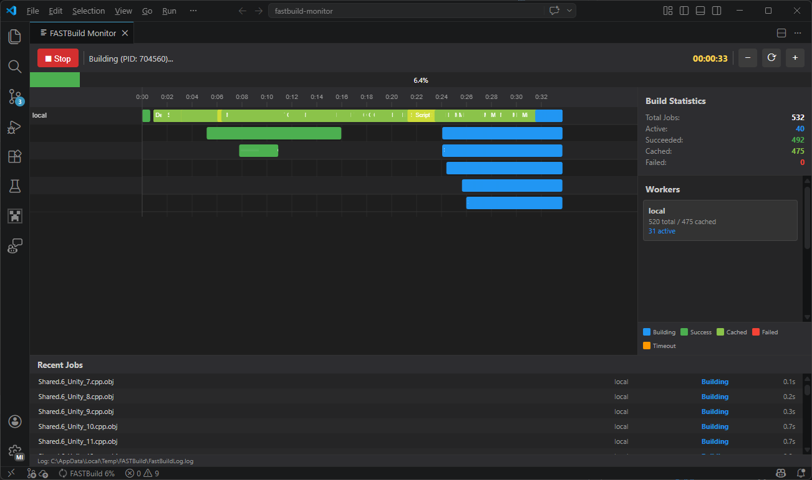

<h1 align="center">
  <br>
  FASTBuild Monitor
  <br>
</h1>

<h4 align="center">Real-time monitoring of <a href="http://www.fastbuild.org/">FASTBuild</a> distributed builds directly inside VS Code, with a Gantt-chart timeline, worker tracking, and build statistics.</h4>


<p align="center">

</p>


## Features

- **Timeline/Gantt chart** — Canvas-rendered visualization of build jobs across workers, color-coded by status. Bar labels use black text for at least 4.5:1 contrast against every status fill in all themes, including legacy mode.
- **Job tooltips** — Hover over any job bar to see name, host, status, and duration
- **Worker panel** — Live active/total/cached job counts per worker host
- **Build statistics** — Total, active, succeeded, cached, and failed counts
- **Progress bar** — Overall build progress percentage with automatically computed black/white text colors for the filled and unfilled portions. The label follows the animated fill boundary and theme changes without an added background.
- **Recent jobs list** — Scrollable feed of the latest jobs with status and timing
- **Theme-aware text colors** — Readable status, statistics, and elapsed-time colors for light and dark themes; high-contrast themes use the theme foreground. Chart colors stay unchanged, and `fbuildMonitor.useLegacyColors` retains the original palette.
- **Status bar integration** — See build progress/status at a glance in the VS Code status bar
- **Zoom & scroll** — Ctrl+wheel zoom, plus zoom in/out/reset buttons
- **Auto-start** — Optionally begin monitoring as soon as the panel opens


## Usage

1. Open VS Code
2. Run **FASTBuild Monitor: Show Build Monitor** from the command palette (Ctrl+Shift+P)
3. Launch your FASTBuild build with the `-monitor` flag:
   ```bash
   FBuild.exe -monitor ...
   ```
4. The monitor will pick up build events in real-time

### Commands

| Command                                 | Description                 |
| --------------------------------------- | --------------------------- |
| `FASTBuild Monitor: Show Build Monitor` | Open the monitor panel      |
| `FASTBuild Monitor: Start Monitoring`   | Start watching the log file |
| `FASTBuild Monitor: Stop Monitoring`    | Stop watching               |

### Settings

| Setting                      | Default | Description                                                                                               |
| ---------------------------- | ------- | --------------------------------------------------------------------------------------------------------- |
| `fbuildmonitor.logPath`      | `""`    | Custom path to `FastBuildLog.log`. Empty = auto-detect from `%TEMP%\FASTBuild\` or `FASTBUILD_TEMP_PATH`. |
| `fbuildmonitor.pollInterval` | `500`   | Log file poll interval in milliseconds (100–5000).                                                        |
| `fbuildmonitor.autoStart`    | `true`  | Auto-start monitoring when the panel opens.                                                               |
